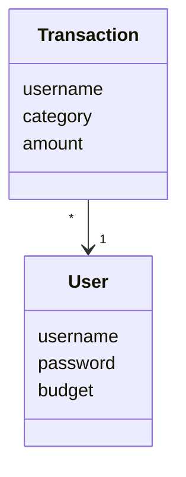
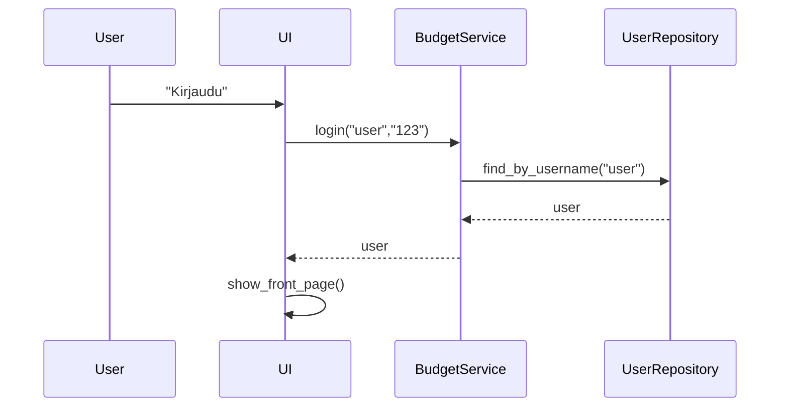
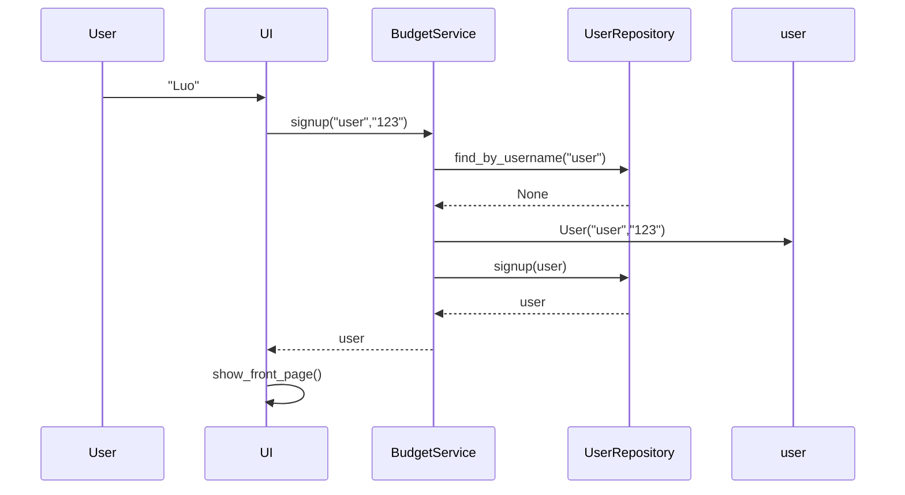
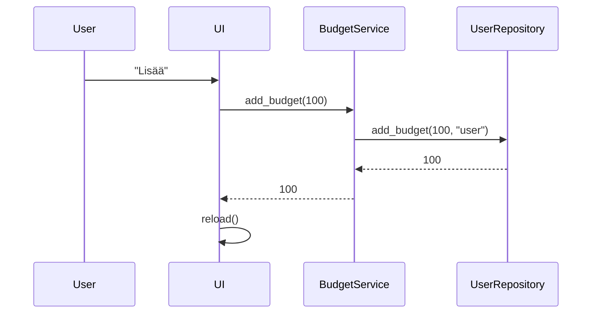
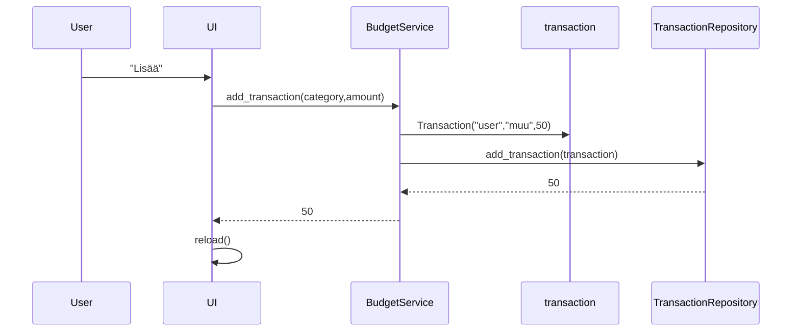

# Arkkitehtuuri

## Sovelluslogiikka

  

- ui sisältää käyttöliittymän koodin
- services sisältää sovelluslogiikan koodin:
  - sovelluslogiikasta vastaa `BudgetService`, joka tarjoaa seuraavat metodit käyttöliittymän toiminnoille:
    - `signup(username, password, login)`  
    - `login(username, password)`  
    - `logout()`  
    - `add_budget(budget)`  
    - `add_income(budget, income)`  
    - `add_transaction(category, amount)`  
    - `get_budget()`  
    - `get_transactions_sum()`  
    - `get_balance()`  
    - `get_transactions_by_category()`  
    - `clear_all()`  
- repositories sisältää tietojen tallennuksesta ja käsittelystä vastaavan koodin
  - `UserRepository`:ssä käsitellään kaikki käyttäjiin liittyvät tietokantaoperaatiot ja `TransactionRepository`:ssä käsitellään käyttäjän menoihin liittyvät tietokantaoperaatiot. Sovelluslogiikka pääsee näiden repositorioiden kautta käsiksi tietokantoihin. 
- entities sisältää luokat, jotka kuvastavat sovelluksen käyttämiä tietokohteita.
  - `User` kuvastaa yksittäistä käyttäjää ja `Transaction` kuvastaa yksittäistä menoa.

## Toiminnallisuudet

### Käyttäjän kirjautuminen

Käyttäjä täyttää käyttäjätunnuksen ja salasanan ja painaa "Kirjaudu"-painiketta. Käyttöliittymän tapahtumankäsittelijä kutsuu sovelluslogiikka `BudgetServicen` metodia `login` kirjautumistiedoilla. Sovelluslogiikka kutsuu `UserRepositoryn` metodia `find_by_username` annetulla käyttätunnuksella ja palauttaa User-oliona käyttäjätunnuksen jos sellainen löytyy. Sovelluslogiikan `login`-metodi selvittää vastaako käyttäjätunnus ja salasana, jos vastaa niin se kirjaa käyttäjän sisään ja palauttaa käyttäjän käyttöliittymälle. Käyttäliittymä päivittää näkymäksi sovelluksen etusivun `show_front_page()`

### Käyttäjän luominen

Käyttäjä täyttää käyttäjätunnuksen ja salasanan ja painaa "Luo"-painiketta. Käyttöliittymän tapahtumankäsittelijä kutsuu sovelluslogiikka `BudgetServicen` metodia `signup` annetuilla tiedoilla. Sovelluslogiikka kutsuu `UserRepositoryn` metodia `find_by_username` annetulla käyttätunnuksella ja palauttaa User-oliona käyttäjätunnuksen jos sellainen löytyy muuten None. Jos käyttäjätunnuksella ei löytynyt käyttäjää kutsuu sovelluslogiikka `UserRepositoryn` metodia signup, joka lisää käyttäjän tietokantaan ja palauttaa luodun käyttäjän. `BudgetService` palauttaa käyttäjän edelleen käyttöliittymälle. Käyttöliittymä päivittää näkymäksi sovelluksen etusivun `show_front_page()`

### Budjetin asettaminen

Käyttäjä asettaa budjetin summan ja painaa "Lisää"-painiketta. Käyttöliittymän tapahtumakäsittelijä kutsuu `BudgetServicen` metodia `add_budget` antamallaan budjetin summalla. Sovelluslogiikka kutsuu annetulla budjetin summalla ja käyttäjätunnuksella `UserRepositoryn` metodia `add_budget`, joka lisää budjetin tietokantaan. `UserRepository` palauttaa lisätyn summan `BudgetServicelle`, joka palauttaa edelleen budjetin käyttöliittymälle. Käyttöliittymä päivittää käyttäjän budjetin `reload`:illa vastaamaan annettua budjettia.

### Menon lisääminen

Käyttäjä lisää uuden menon valitsemalla kategorian listasta ja lisää menon summan painamalla "Lisää"-painiketta. Käyttöliittymän tapahtumakäsittelijä kutsuu juuri annetuilla tiedoilla `BudgetServicen` metodia `add_transaction` joka luo käyttäjästä, kategoriasta ja summasta transaction-olion. Sovelluslogiikka kutsuu `TransactionRepositoryn` metodia `add_transaction` transaction-olio parametrinään. Metodi lisää menon tietokantaa ja palauttaa sovelluslogiikalle lisätyn menon summan. Sovelluslogiikka palauttaa summan edelleen käyttöliittymälle, joka päivittää `reload`:illa annetut tiedot etusivulle.

