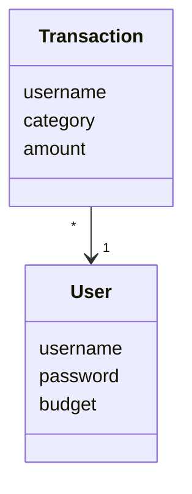
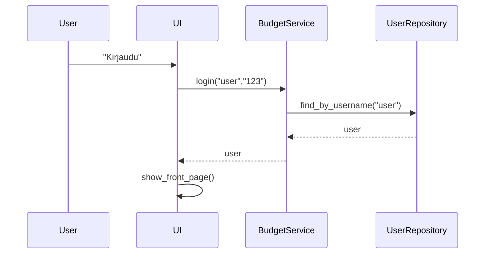

# Arkkitehtuuri

## Sovelluslogiikka

```mermaid
classDiagram
Transaction "*" --> "1" User
Transaction: username
Transaction: category
Transaction: amount
User: username
User: password
User: budget
```
### Pakkauskaavio

## Toiminnallisuudet

### Käyttäjän kirjautuminen

```mermaid
sequenceDiagram
User ->> UI: "Kirjaudu"
UI ->> BudgetService: login("user","123")
BudgetService ->> UserRepository: find_by_username("user")
UserRepository -->> BudgetService: user
BudgetService -->> UI: user
UI ->> UI: show_front_page()

```

