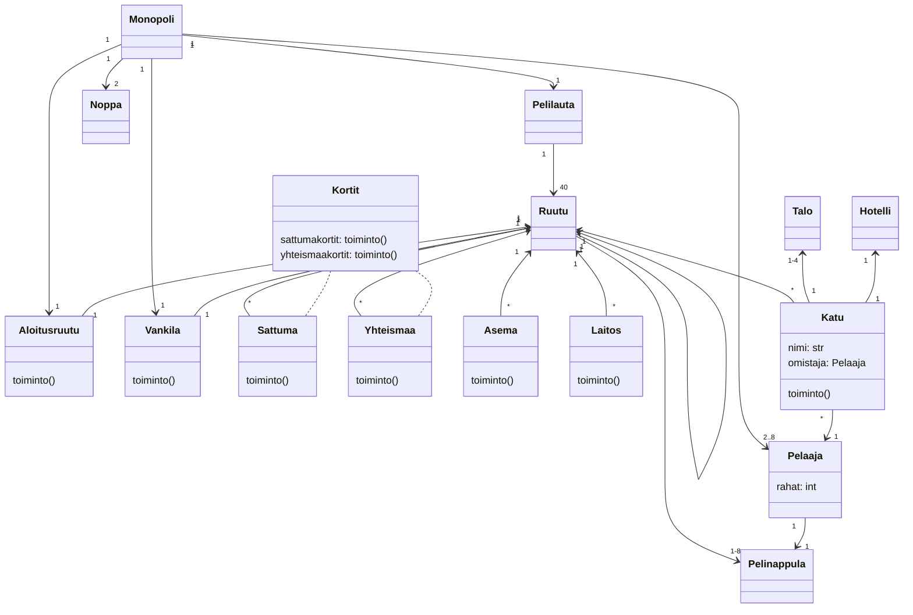

```mermaid
classDiagram
Monopoli "1" --> "1" Pelilauta
Pelilauta "1" --> "40" Ruutu
Ruutu "1" --> Ruutu
Ruutu "1" --> "1-8" Pelinappula
Monopoli "1" --> "2" Noppa
Monopoli "1" --> "2..8" Pelaaja
Pelaaja "1" --> "1" Pelinappula
Monopoli "1" --> "1" Aloitusruutu
Monopoli "1" --> "1" Vankila
Ruutu "1" <-- "1" Aloitusruutu
Ruutu "1" <-- "1" Vankila
Ruutu "1" <-- "*" Sattuma
Ruutu "1" <-- "*" Yhteismaa
Ruutu "1" <-- "*" Asema
Ruutu "1" <-- "*" Laitos
Ruutu "1" <-- "*" Katu
Katu "*" --> "1" Pelaaja
Kortit .. Sattuma
Kortit .. Yhteismaa
Talo "1-4" <-- "1" Katu
Hotelli "1" <-- "1" Katu


class Pelaaja{
  rahat: int
  }

class Aloitusruutu {
  toiminto()
  }
class Vankila {
  toiminto()
  }
class Sattuma {
toiminto()
}
class Yhteismaa {
  toiminto()
}
class Asema {
  toiminto()
}
class Laitos {
  toiminto()
}
class Katu {
  nimi: str
  omistaja: Pelaaja

  toiminto()
}
class Kortit {
  sattumakortit: toiminto()
  yhteismaakortit: toiminto()
}
```